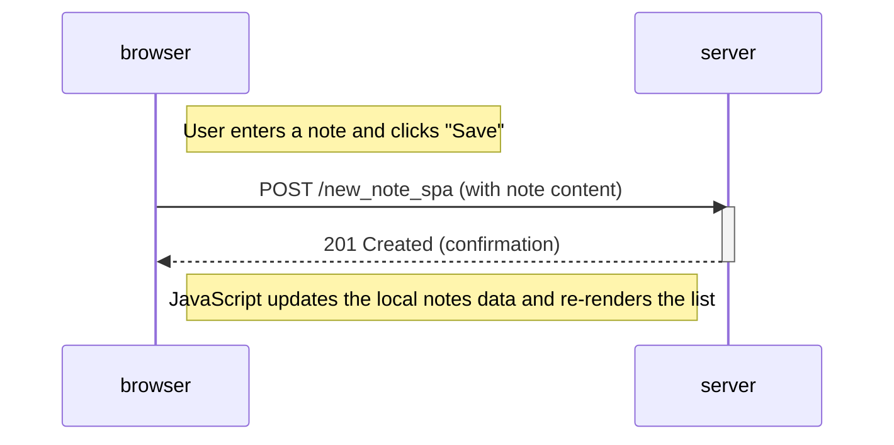

```mermaid
sequenceDiagram
    participant browser
    participant server

    Note right of browser: User enters a note and clicks "Save"

    browser->>server: POST /new_note_spa (with note content)
    activate server
    server-->>browser: 201 Created (confirmation)
    deactivate server

    Note right of browser: JavaScript updates the local notes data and re-renders the list
```